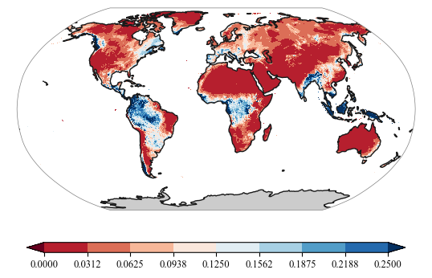
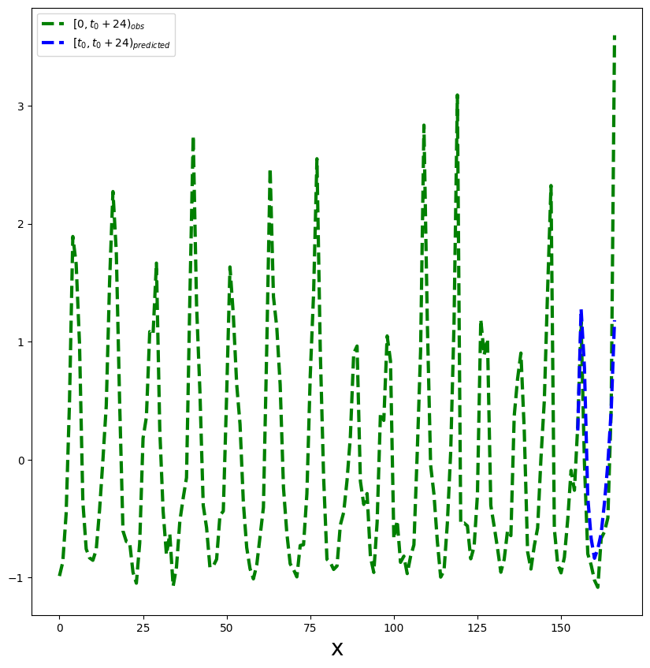
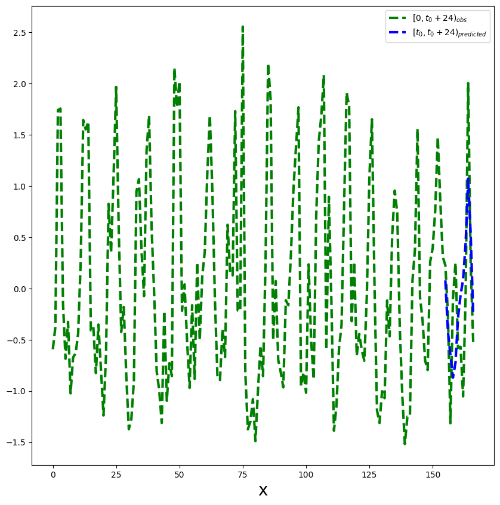
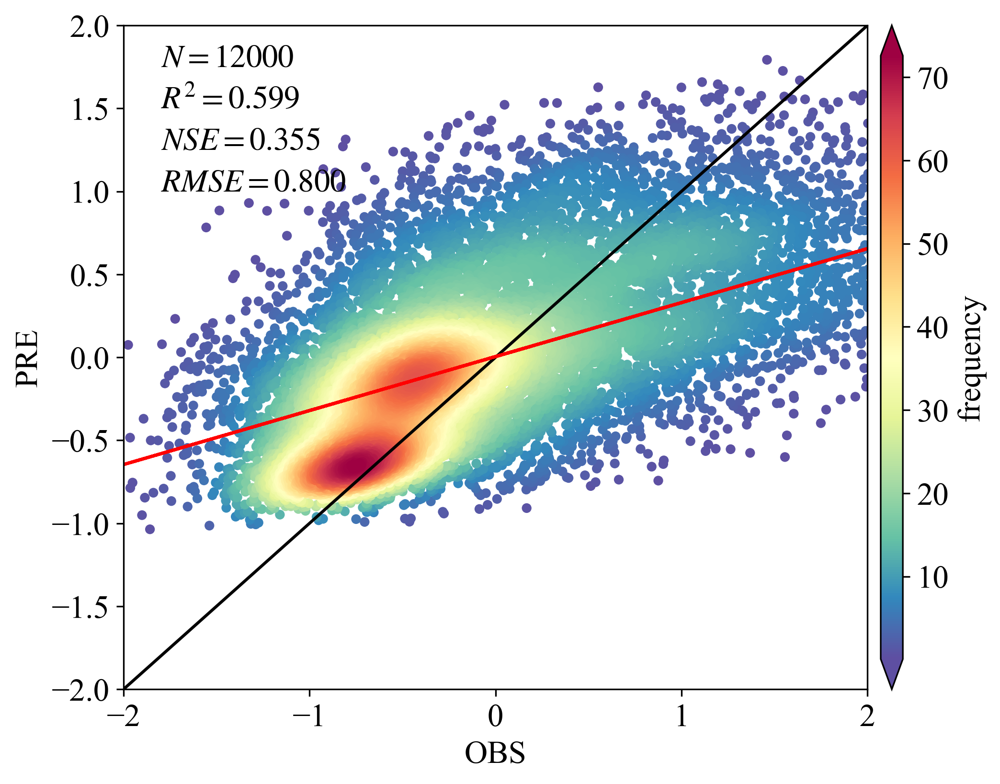

```python
import torch
import torch as t
import numpy as np
import torch.nn as nn
import torch.optim as optim
from torchnet import meter
import xarray as xr
import rioxarray as rxr
```


```python
torch.cuda.is_available()
```


    True


```python
precipitation_data = rxr.open_rasterio('data/prcp.tif').values

# 将数据转换为 PyTorch 张量
precipitation_data = torch.tensor(precipitation_data, dtype=torch.float32)

precipitation_mean = torch.mean(precipitation_data, 0)
precipitation_std = torch.std(precipitation_data, 0)
precipitation = (precipitation_data - precipitation_mean) / precipitation_std

precipitation_re = precipitation.reshape(183,-1).transpose(0,1)
```


```python
from utils import plot
import matplotlib.pyplot as plt
import cartopy.crs as ccrs
import numpy as np
import xarray as xr
file_name='data/train/prcp.tif'
ds=xr.open_dataset(file_name)
data = ds['band_data'][7]

fig = plt.figure()
proj = ccrs.Robinson() #ccrs.Robinson()ccrs.Mollweide()Mollweide()
ax = fig.add_subplot(111, projection=proj)
levels = np.linspace(0, 0.25, num=9)
plot.one_map_flat(data, ax, levels=levels, cmap="RdBu",  mask_ocean=False, add_coastlines=True, add_land=True,  colorbar=True, plotfunc="pcolormesh")
```


    <cartopy.mpl.geocollection.GeoQuadMesh at 0x1c9263ca490>


    

    


```python
# 创建二维矩阵
import random
matrix = torch.mean(torch.stack([torch.mean(precipitation_re, 1)], 1), 1).flatten()
# 将矩阵中值为NaN的元素置为0
matrix[torch.isnan(matrix)] = 0

# 获取所有不为NaN的元素的索引
non_negative_indices = torch.nonzero(matrix)
precipitation_re = precipitation_re[non_negative_indices.flatten(), :]
```


```python
class Config(object):
    t0 = 155 #155
    t1 = 12 
    t = t0 + t1
    train_num = 8000 #8
    validation_num = 1000  #1
    test_num = 1000  #1
    in_channels = 1
    batch_size = 500 #500 NSE 0.75
    lr = .0005 # learning rate
    epochs = 100
```


```python
import torch
import matplotlib.pyplot as plt
import numpy as np
from torch.utils.data import Dataset
    
class time_series_decoder_paper(Dataset):
    """synthetic time series dataset from section 5.1"""
    
    def __init__(self,t0=120,N=4500,dx=None,dy=None,transform=None):
        """
        Args:
            t0: previous t0 data points to predict from
            N: number of data points
            transform: any transformations to be applied to time series
        """
        self.t0 = t0
        self.N = N
        self.dx = dx
        self.dy = dy
        self.transform = None
    
        
        # time points
        #self.x = torch.cat(N*[torch.arange(0,t0+24).type(torch.float).unsqueeze(0)])
        self.x = dx  
        self.fx = dy
        # self.fx = torch.cat([A1.unsqueeze(1)*torch.sin(np.pi*self.x[0,0:12]/6)+72 ,
        #                 A2.unsqueeze(1)*torch.sin(np.pi*self.x[0,12:24]/6)+72 ,
        #                 A3.unsqueeze(1)*torch.sin(np.pi*self.x[0,24:t0]/6)+72,
        #                 A4.unsqueeze(1)*torch.sin(np.pi*self.x[0,t0:t0+24]/12)+72],1)
        
        # add noise
        # self.fx = self.fx + torch.randn(self.fx.shape)
        
        self.masks = self._generate_square_subsequent_mask(t0)
                
        
        # print out shapes to confirm desired output
        print("x: ",self.x.shape,
              "fx: ",self.fx.shape)
        
    def __len__(self):
        return len(self.fx)
    
    def __getitem__(self,idx):
        if torch.is_tensor(idx):
            idx = idx.tolist()
            
        
        sample = (self.x[idx,:,:], #self.x[idx,:]
                  self.fx[idx,:],
                  self.masks)
        
        if self.transform:
            sample=self.transform(sample)
            
        return sample
    
    def _generate_square_subsequent_mask(self,t0):
        mask = torch.zeros(Config.t,Config.t)
        for i in range(0,Config.t0):
            mask[i,Config.t0:] = 1 
        for i in range(Config.t0,Config.t):
            mask[i,i+1:] = 1
        mask = mask.float().masked_fill(mask == 1, float('-inf'))#.masked_fill(mask == 1, float(0.0))
        return mask
```


```python
class TransformerTimeSeries(torch.nn.Module):
    """
    Time Series application of transformers based on paper
    
    causal_convolution_layer parameters:
        in_channels: the number of features per time point
        out_channels: the number of features outputted per time point
        kernel_size: k is the width of the 1-D sliding kernel
        
    nn.Transformer parameters:
        d_model: the size of the embedding vector (input)
    
    PositionalEncoding parameters:
        d_model: the size of the embedding vector (positional vector)
        dropout: the dropout to be used on the sum of positional+embedding vector
    
    """
    def __init__(self):
        super(TransformerTimeSeries,self).__init__()
        self.input_embedding = context_embedding(Config.in_channels+1,256,5)
        self.positional_embedding = torch.nn.Embedding(512,256)

        
        self.decode_layer = torch.nn.TransformerEncoderLayer(d_model=256,nhead=8)
        self.transformer_decoder = torch.nn.TransformerEncoder(self.decode_layer, num_layers=3)
        
        self.fc1 = torch.nn.Linear(256,1)
        
    def forward(self,x,y,attention_masks):
        
        # concatenate observed points and time covariate
        # (B*feature_size*n_time_points)
#re     z = torch.cat((y.unsqueeze(1),x.unsqueeze(1)),1)
        z = torch.cat((y,x),1)
        # input_embedding returns shape (Batch size,embedding size,sequence len) -> need (sequence len,Batch size,embedding_size)
#re        z_embedding = self.input_embedding(z).permute(2,0,1)
        z_embedding = self.input_embedding(z).unsqueeze(1).permute(3, 1, 0, 2)
        # get my positional embeddings (Batch size, sequence_len, embedding_size) -> need (sequence len,Batch size,embedding_size)
        x1 = x.type(torch.long)
        x1[x1 < 0] = 0
        positional_embeddings = self.positional_embedding(x1).permute(2, 1, 0, 3)
#re      #positional_embeddings = self.positional_embedding(x.type(torch.long)).permute(1,0,2)
        
        input_embedding = z_embedding+positional_embeddings
        input_embedding1 = torch.mean(input_embedding, 1)
        transformer_embedding = self.transformer_decoder(input_embedding1,attention_masks)

        output = self.fc1(transformer_embedding.permute(1,0,2))
        
        return output
import torch
import numpy as np
import matplotlib.pyplot as plt
import torch.nn.functional as F

class CausalConv1d(torch.nn.Conv1d):
    def __init__(self,
                 in_channels,
                 out_channels,
                 kernel_size,
                 stride=1,
                 dilation=1,
                 groups=1,
                 bias=True):

        super(CausalConv1d, self).__init__(
            in_channels,
            out_channels,
            kernel_size=kernel_size,
            stride=stride,
            padding=0,
            dilation=dilation,
            groups=groups,
            bias=bias)
        
        self.__padding = (kernel_size - 1) * dilation
        
    def forward(self, input):
        return super(CausalConv1d, self).forward(F.pad(input, (self.__padding, 0)))


class context_embedding(torch.nn.Module):
    def __init__(self,in_channels=Config.in_channels,embedding_size=256,k=5):
        super(context_embedding,self).__init__()
        self.causal_convolution = CausalConv1d(in_channels,embedding_size,kernel_size=k)

    def forward(self,x):
        x = self.causal_convolution(x)
        return torch.tanh(x)
```


```python
class LSTM_Time_Series(torch.nn.Module):
    def __init__(self,input_size=2,embedding_size=256,kernel_width=9,hidden_size=512):
        super(LSTM_Time_Series,self).__init__()
        
        self.input_embedding = context_embedding(input_size,embedding_size,kernel_width)    
        
        self.lstm = torch.nn.LSTM(embedding_size,hidden_size,batch_first=True)
        
        self.fc1 = torch.nn.Linear(hidden_size,1)
        
    def forward(self,x,y):
        """
        x: the time covariate
        y: the observed target
        """
        # concatenate observed points and time covariate
        # (B,input size + covariate size,sequence length)
        # z = torch.cat((y.unsqueeze(1),x.unsqueeze(1)),1)
        z_obs = torch.cat((y.unsqueeze(1),x.unsqueeze(1)),1)
        if isLSTM:
            z_obs = torch.cat((y, x),1)
        # input_embedding returns shape (B,embedding size,sequence length)
        z_obs_embedding = self.input_embedding(z_obs)
        
        # permute axes (B,sequence length, embedding size)
        z_obs_embedding = self.input_embedding(z_obs).permute(0,2,1)
                
        # all hidden states from lstm
        # (B,sequence length,num_directions * hidden size)
        lstm_out,_ = self.lstm(z_obs_embedding)
        
        # input to nn.Linear: (N,*,Hin)
        # output (N,*,Hout)
        return self.fc1(lstm_out)
```


```python
from torch.utils.data import DataLoader
import random
random.seed(0)

random_indices = random.sample(range(non_negative_indices.shape[0]), Config.train_num)
random_indices1 = random.sample(range(non_negative_indices.shape[0]), Config.validation_num)
random_indices2 = random.sample(range(non_negative_indices.shape[0]), Config.test_num)
dx = torch.stack([torch.cat(Config.train_num*[torch.arange(0,Config.t).type(torch.float).unsqueeze(0)]).cuda()], 1)
dx1 = torch.stack([torch.cat(Config.validation_num*[torch.arange(0,Config.t).type(torch.float).unsqueeze(0)]).cuda()], 1)
dx2 = torch.stack([torch.cat(Config.test_num*[torch.arange(0,Config.t).type(torch.float).unsqueeze(0)]).cuda()], 1)
train_dataset = time_series_decoder_paper(t0=Config.t0,N=Config.train_num,dx=dx ,dy=precipitation_re[np.array([random_indices]).flatten(),0:Config.t].unsqueeze(1))
validation_dataset = time_series_decoder_paper(t0=Config.t0,N=Config.validation_num,dx=dx1,dy=precipitation_re[np.array([random_indices1]).flatten(),0:Config.t].unsqueeze(1))
test_dataset = time_series_decoder_paper(t0=Config.t0,N=Config.test_num,dx=dx2,dy=precipitation_re[np.array([random_indices2]).flatten(),0:Config.t].unsqueeze(1))
```

    x:  torch.Size([8000, 1, 167]) fx:  torch.Size([8000, 1, 167])
    x:  torch.Size([1000, 1, 167]) fx:  torch.Size([1000, 1, 167])
    x:  torch.Size([1000, 1, 167]) fx:  torch.Size([1000, 1, 167])
    


```python
criterion = torch.nn.MSELoss()
train_dl = DataLoader(train_dataset,batch_size=Config.batch_size,shuffle=True, generator=torch.Generator(device='cpu'))
validation_dl = DataLoader(validation_dataset,batch_size=Config.batch_size, generator=torch.Generator(device='cpu'))
test_dl = DataLoader(test_dataset,batch_size=Config.batch_size, generator=torch.Generator(device='cpu'))
```


```python
criterion_LSTM = torch.nn.MSELoss()
```


```python
LSTM = LSTM_Time_Series().cuda()
```


```python
def Dp(y_pred,y_true,q):
    return max([q*(y_pred-y_true),(q-1)*(y_pred-y_true)])

def Rp_num_den(y_preds,y_trues,q):
    numerator = np.sum([Dp(y_pred,y_true,q) for y_pred,y_true in zip(y_preds,y_trues)])
    denominator = np.sum([np.abs(y_true) for y_true in y_trues])
    return numerator,denominator
def train_epoch(LSTM,train_dl,t0=Config.t0):
    LSTM.train()
    train_loss = 0
    n = 0
    for step,(x,y,_) in enumerate(train_dl):
        x = x.cuda()
        y = y.cuda()
        
        optimizer.zero_grad()
        output = LSTM(x,y)
        
        loss = criterion(output.squeeze()[:,(Config.t0-1):(Config.t0+Config.t1-1)],y.cuda()[:,0,Config.t0:])        
        loss.backward()
        optimizer.step()
        
        train_loss += (loss.detach().cpu().item() * x.shape[0])
        n += x.shape[0]
    return train_loss/n
def eval_epoch(LSTM,validation_dl,t0=Config.t0):
    LSTM.eval()
    eval_loss = 0
    n = 0
    with torch.no_grad():
        for step,(x,y,_) in enumerate(train_dl):
            x = x.cuda()
            y = y.cuda()

            output = LSTM(x,y)
            loss = criterion(output.squeeze()[:,(Config.t0-1):(Config.t0+Config.t1-1)],y.cuda()[:,0,Config.t0:])        
        
            eval_loss += (loss.detach().cpu().item() * x.shape[0])
            n += x.shape[0]
            
    return eval_loss/n
def test_epoch(LSTM,test_dl,t0=Config.t0):
    with torch.no_grad():
        predictions = []
        observations = []

        LSTM.eval()
        for step,(x,y,_) in enumerate(train_dl):
            x = x.cuda()
            y = y.cuda()

            output = LSTM(x,y)

            for p,o in zip(output.squeeze()[:,(Config.t0-1):(Config.t0+Config.t1-1)].cpu().numpy().tolist(),y.cuda()[:,0,Config.t0:].cpu().numpy().tolist()):

                predictions.append(p)
                observations.append(o)

        num = 0
        den = 0
        for y_preds,y_trues in zip(predictions,observations):
            num_i,den_i = Rp_num_den(y_preds,y_trues,.5)
            num+=num_i
            den+=den_i
        Rp = (2*num)/den
        
    return Rp
```


```python
train_epoch_loss = []
eval_epoch_loss = []
Rp_best = 30
isLSTM = True
optimizer = torch.optim.Adam(LSTM.parameters(), lr=Config.lr)

for e,epoch in enumerate(range(Config.epochs)):
    train_loss = []
    eval_loss = []
    
    l_train = train_epoch(LSTM,train_dl)
    train_loss.append(l_train)
    
    l_eval = eval_epoch(LSTM,validation_dl)
    eval_loss.append(l_eval)
            
    Rp = test_epoch(LSTM,test_dl)
    
    if Rp_best > Rp:
        Rp_best = Rp

    with torch.no_grad():
        print("Epoch {}: Train loss={} \t Eval loss = {} \t Rp={}".format(e,np.mean(train_loss),np.mean(eval_loss),Rp))
        
        train_epoch_loss.append(np.mean(train_loss))
        eval_epoch_loss.append(np.mean(eval_loss))
```

    Epoch 0: Train loss=1.169178232550621 	 Eval loss = 1.0225972533226013 	 Rp=0.9754564549482763
    Epoch 1: Train loss=1.0208212696015835 	 Eval loss = 1.0133976340293884 	 Rp=0.992397172460293
    Epoch 2: Train loss=1.0135348699986935 	 Eval loss = 1.0102826319634914 	 Rp=1.0010193148701694
    Epoch 3: Train loss=1.0075771994888783 	 Eval loss = 1.003737311810255 	 Rp=0.9874602462009079
    Epoch 4: Train loss=0.9986509047448635 	 Eval loss = 0.991193663328886 	 Rp=0.9851476850727866
    Epoch 5: Train loss=0.9815127141773701 	 Eval loss = 0.9676672779023647 	 Rp=0.9776791701859356
    Epoch 6: Train loss=0.9377330988645554 	 Eval loss = 0.8851083293557167 	 Rp=0.9021427715861259
    Epoch 7: Train loss=0.8124373629689217 	 Eval loss = 0.776776347309351 	 Rp=0.8164312307396333
    Epoch 8: Train loss=0.7808051072061062 	 Eval loss = 0.7724409475922585 	 Rp=0.8044285279275872
    Epoch 9: Train loss=0.7723440378904343 	 Eval loss = 0.7691570967435837 	 Rp=0.8276665115435272
    Epoch 10: Train loss=0.7680666074156761 	 Eval loss = 0.7604397684335709 	 Rp=0.8172812960763582
    Epoch 11: Train loss=0.7637499608099461 	 Eval loss = 0.7642757333815098 	 Rp=0.7958800149846623
    Epoch 12: Train loss=0.7604391016066074 	 Eval loss = 0.7545832060277462 	 Rp=0.7959258052455023
    Epoch 13: Train loss=0.7542793937027454 	 Eval loss = 0.758263424038887 	 Rp=0.8029712542553213
    Epoch 14: Train loss=0.7513296827673912 	 Eval loss = 0.74464987590909 	 Rp=0.7928307957450957
    Epoch 15: Train loss=0.7609197050333023 	 Eval loss = 0.7561161443591118 	 Rp=0.7961394733618599
    Epoch 16: Train loss=0.7611901015043259 	 Eval loss = 0.754481915384531 	 Rp=0.8042048513261087
    Epoch 17: Train loss=0.7494660168886185 	 Eval loss = 0.7436127960681915 	 Rp=0.808727372545216
    Epoch 18: Train loss=0.7624928876757622 	 Eval loss = 0.7601931132376194 	 Rp=0.8278642644450237
    Epoch 19: Train loss=0.7445684559643269 	 Eval loss = 0.7404011972248554 	 Rp=0.7988691222148593
    Epoch 20: Train loss=0.7364756055176258 	 Eval loss = 0.7331099547445774 	 Rp=0.7900263164250347
    Epoch 21: Train loss=0.7366516776382923 	 Eval loss = 0.7335694879293442 	 Rp=0.7858690993104261
    Epoch 22: Train loss=0.7310461960732937 	 Eval loss = 0.7295852825045586 	 Rp=0.7947732982354974
    Epoch 23: Train loss=0.7325067669153214 	 Eval loss = 0.7321035303175449 	 Rp=0.7994415259947144
    Epoch 24: Train loss=0.7324810847640038 	 Eval loss = 0.7215580977499485 	 Rp=0.7793204264401973
    Epoch 25: Train loss=0.7343184538185596 	 Eval loss = 0.7716133445501328 	 Rp=0.8319286623223218
    Epoch 26: Train loss=0.7366975098848343 	 Eval loss = 0.7249130606651306 	 Rp=0.77453832290699
    Epoch 27: Train loss=0.7278863601386547 	 Eval loss = 0.720306035131216 	 Rp=0.7780187017935781
    Epoch 28: Train loss=0.7243384085595608 	 Eval loss = 0.715414222329855 	 Rp=0.7660441378673354
    Epoch 29: Train loss=0.7391963303089142 	 Eval loss = 0.8104664944112301 	 Rp=0.848384596737658
    Epoch 30: Train loss=0.7501446716487408 	 Eval loss = 0.7330859526991844 	 Rp=0.7958694240958736
    Epoch 31: Train loss=0.7319861426949501 	 Eval loss = 0.7288344763219357 	 Rp=0.7764215311271584
    Epoch 32: Train loss=0.7289896085858345 	 Eval loss = 0.7186561860144138 	 Rp=0.7719541082002876
    Epoch 33: Train loss=0.7208635434508324 	 Eval loss = 0.7130853533744812 	 Rp=0.7693201078171342
    Epoch 34: Train loss=0.7188350297510624 	 Eval loss = 0.7184220626950264 	 Rp=0.7790605390063141
    Epoch 35: Train loss=0.7278616651892662 	 Eval loss = 0.7226458676159382 	 Rp=0.7934061207417414
    Epoch 36: Train loss=0.7257222011685371 	 Eval loss = 0.7461872175335884 	 Rp=0.8043810986938649
    Epoch 37: Train loss=0.722360011190176 	 Eval loss = 0.7184372805058956 	 Rp=0.7733680838057659
    Epoch 38: Train loss=0.7406770437955856 	 Eval loss = 0.7328226044774055 	 Rp=0.7792520400962948
    Epoch 39: Train loss=0.7231648564338684 	 Eval loss = 0.7170744873583317 	 Rp=0.7745043319879358
    Epoch 40: Train loss=0.7179877758026123 	 Eval loss = 0.7121099643409252 	 Rp=0.7665604319856079
    Epoch 41: Train loss=0.7204379811882973 	 Eval loss = 0.7137661874294281 	 Rp=0.7697876723151911
    Epoch 42: Train loss=0.7189657613635063 	 Eval loss = 0.7145831622183323 	 Rp=0.7683013184528533
    Epoch 43: Train loss=0.7236194014549255 	 Eval loss = 0.7213072367012501 	 Rp=0.7794286898969346
    Epoch 44: Train loss=0.7113666497170925 	 Eval loss = 0.7064446061849594 	 Rp=0.7730508504910318
    Epoch 45: Train loss=0.7169638313353062 	 Eval loss = 0.7072659730911255 	 Rp=0.7818726340368028
    Epoch 46: Train loss=0.7137239314615726 	 Eval loss = 0.7547547481954098 	 Rp=0.8419246011202801
    Epoch 47: Train loss=0.7260657027363777 	 Eval loss = 0.7107443884015083 	 Rp=0.7655332919045247
    Epoch 48: Train loss=0.7079816907644272 	 Eval loss = 0.7071417346596718 	 Rp=0.773454930517809
    Epoch 49: Train loss=0.7094167955219746 	 Eval loss = 0.7058326154947281 	 Rp=0.7727462602735332
    Epoch 50: Train loss=0.7380903214216232 	 Eval loss = 0.7227592132985592 	 Rp=0.769177665270142
    Epoch 51: Train loss=0.7130068391561508 	 Eval loss = 0.7105456776916981 	 Rp=0.7592860561025371
    Epoch 52: Train loss=0.7084374688565731 	 Eval loss = 0.7031594552099705 	 Rp=0.7660899650703171
    Epoch 53: Train loss=0.7042888924479485 	 Eval loss = 0.7040572166442871 	 Rp=0.7721988413128251
    Epoch 54: Train loss=0.7063969075679779 	 Eval loss = 0.6986251175403595 	 Rp=0.7695131487850577
    Epoch 55: Train loss=0.7053375691175461 	 Eval loss = 0.7212032824754715 	 Rp=0.7735872477697779
    Epoch 56: Train loss=0.7035926096141338 	 Eval loss = 0.7097134478390217 	 Rp=0.784710594937848
    Epoch 57: Train loss=0.735156461596489 	 Eval loss = 0.8654714487493038 	 Rp=0.911015246823642
    Epoch 58: Train loss=0.8107807412743568 	 Eval loss = 0.7581384815275669 	 Rp=0.8157151369086734
    Epoch 59: Train loss=0.7544550113379955 	 Eval loss = 0.7499602921307087 	 Rp=0.7949385155087615
    Epoch 60: Train loss=0.746234655380249 	 Eval loss = 0.7389007620513439 	 Rp=0.7862202786182774
    Epoch 61: Train loss=0.7351461201906204 	 Eval loss = 0.7316578552126884 	 Rp=0.7699839364702437
    Epoch 62: Train loss=0.7276912368834019 	 Eval loss = 0.7233806289732456 	 Rp=0.7752237105789992
    Epoch 63: Train loss=0.7192910276353359 	 Eval loss = 0.7333457358181477 	 Rp=0.7724518923905164
    Epoch 64: Train loss=0.7260234951972961 	 Eval loss = 0.7129928097128868 	 Rp=0.7660325583116143
    Epoch 65: Train loss=0.7277122773230076 	 Eval loss = 0.7464463748037815 	 Rp=0.7795688062338593
    Epoch 66: Train loss=0.7259447425603867 	 Eval loss = 0.7074765078723431 	 Rp=0.7646423879285662
    Epoch 67: Train loss=0.7121074683964252 	 Eval loss = 0.7206148467957973 	 Rp=0.7670712925578708
    Epoch 68: Train loss=0.7051395028829575 	 Eval loss = 0.7368365041911602 	 Rp=0.8174581520496608
    Epoch 69: Train loss=0.7655579410493374 	 Eval loss = 0.7538384310901165 	 Rp=0.7762011659936345
    Epoch 70: Train loss=0.7304071560502052 	 Eval loss = 0.7248818911612034 	 Rp=0.791938228314532
    Epoch 71: Train loss=0.7145950980484486 	 Eval loss = 0.7085471898317337 	 Rp=0.771219627305778
    Epoch 72: Train loss=0.705636128783226 	 Eval loss = 0.7026742734014988 	 Rp=0.7582436097165333
    Epoch 73: Train loss=0.7039311081171036 	 Eval loss = 0.701056282967329 	 Rp=0.7621456124101622
    Epoch 74: Train loss=0.7022229805588722 	 Eval loss = 0.7022544406354427 	 Rp=0.7572908772835294
    Epoch 75: Train loss=0.7077537477016449 	 Eval loss = 0.7068974897265434 	 Rp=0.7689672806983037
    Epoch 76: Train loss=0.70463952049613 	 Eval loss = 0.7016653120517731 	 Rp=0.7620379826248179
    Epoch 77: Train loss=0.6936824433505535 	 Eval loss = 0.6882451064884663 	 Rp=0.7536649577052977
    Epoch 78: Train loss=0.7085927426815033 	 Eval loss = 0.7006802186369896 	 Rp=0.7573836578425687
    Epoch 79: Train loss=0.6964434124529362 	 Eval loss = 0.6970510184764862 	 Rp=0.7566034081453576
    Epoch 80: Train loss=0.7041287049651146 	 Eval loss = 0.7041221261024475 	 Rp=0.7517282641309433
    Epoch 81: Train loss=0.7040938474237919 	 Eval loss = 0.694716889411211 	 Rp=0.7518976134462692
    Epoch 82: Train loss=0.6934744939208031 	 Eval loss = 0.6876317113637924 	 Rp=0.7490530317847554
    Epoch 83: Train loss=0.6924876533448696 	 Eval loss = 0.7114526480436325 	 Rp=0.7712103875056127
    Epoch 84: Train loss=0.70367331802845 	 Eval loss = 0.6974217854440212 	 Rp=0.7550885913055979
    Epoch 85: Train loss=0.7047922983765602 	 Eval loss = 0.6882399097084999 	 Rp=0.7489761214479039
    Epoch 86: Train loss=0.6913500241935253 	 Eval loss = 0.6827207766473293 	 Rp=0.744314955284494
    Epoch 87: Train loss=0.6916158571839333 	 Eval loss = 0.6919064372777939 	 Rp=0.7509365031084853
    Epoch 88: Train loss=0.6971654705703259 	 Eval loss = 0.6914562620222569 	 Rp=0.7441346646542655
    Epoch 89: Train loss=0.6963543370366096 	 Eval loss = 0.691758755594492 	 Rp=0.7572971481054963
    Epoch 90: Train loss=0.6917684748768806 	 Eval loss = 0.6856491975486279 	 Rp=0.7448740185296933
    Epoch 91: Train loss=0.6941814571619034 	 Eval loss = 0.6949076354503632 	 Rp=0.7525349231139533
    Epoch 92: Train loss=0.69602020829916 	 Eval loss = 0.7147903628647327 	 Rp=0.7746622771469637
    Epoch 93: Train loss=0.6934036538004875 	 Eval loss = 0.689013235270977 	 Rp=0.7674142639047323
    Epoch 94: Train loss=0.6828178651630878 	 Eval loss = 0.6839329451322556 	 Rp=0.749017388184114
    Epoch 95: Train loss=0.6820085123181343 	 Eval loss = 0.679760005325079 	 Rp=0.7496224481291669
    Epoch 96: Train loss=0.6940162815153599 	 Eval loss = 0.6897397376596928 	 Rp=0.7505375270808133
    Epoch 97: Train loss=0.6879976131021976 	 Eval loss = 0.7038531377911568 	 Rp=0.7740689357717414
    Epoch 98: Train loss=0.6902556456625462 	 Eval loss = 0.6736902967095375 	 Rp=0.7441236415340688
    Epoch 99: Train loss=0.6990400142967701 	 Eval loss = 0.7069363221526146 	 Rp=0.7699857686313047
    


```python
import os
os.environ["KMP_DUPLICATE_LIB_OK"]="TRUE"
n_plots = 5

t0=120
with torch.no_grad():
    LSTM.eval()
    for step,(x,y,_) in enumerate(test_dl):
        x = x.cuda()
        y = y.cuda()

        output = LSTM(x,y)


        if step > n_plots:
            break

        with torch.no_grad():
            plt.figure(figsize=(10,10))
            plt.plot(x[1, 0].cpu().detach().squeeze().numpy(),y[1].cpu().detach().squeeze().numpy(),'g--',linewidth=3)    
            plt.plot(x[1, 0, Config.t0:].cpu().detach().squeeze().numpy(),output[1,(Config.t0-1):(Config.t0+Config.t1-1),0].cpu().detach().squeeze().numpy(),'b--',linewidth=3)

            plt.xlabel("x",fontsize=20)
            plt.legend(["$[0,t_0+24)_{obs}$","$[t_0,t_0+24)_{predicted}$"])
            plt.show()
```


    

    


    

    


```python
matrix = torch.empty(0).cuda()
obsmat = torch.empty(0).cuda()

with torch.no_grad():
    LSTM.eval()
    predictions = []
    observations = []
    for step,(x,y,attention_masks) in enumerate(test_dl):
        # if step == 8:
        #     break
        output = LSTM(x.cuda(),y.cuda())
        matrix = torch.cat((matrix, output.cuda()))
        obsmat = torch.cat((obsmat, y.cuda()))

pre = matrix.cpu().detach().numpy()
obs = obsmat.cpu().detach().numpy()
# libraries
import matplotlib.pyplot as plt
import numpy as np
import pandas as pd

# data
df = pd.DataFrame({
  'obs': obs[:, 0, Config.t0:Config.t].flatten(),
  'pre': pre[:, Config.t0:Config.t, 0].flatten()
})
df
```


<div>
<style scoped>
    .dataframe tbody tr th:only-of-type {
        vertical-align: middle;
    }

    .dataframe tbody tr th {
        vertical-align: top;
    }

    .dataframe thead th {
        text-align: right;
    }
</style>
<table border="1" class="dataframe">
  <thead>
    <tr style="text-align: right;">
      <th></th>
      <th>obs</th>
      <th>pre</th>
    </tr>
  </thead>
  <tbody>
    <tr>
      <th>0</th>
      <td>1.195594</td>
      <td>1.645856</td>
    </tr>
    <tr>
      <th>1</th>
      <td>1.649769</td>
      <td>0.247605</td>
    </tr>
    <tr>
      <th>2</th>
      <td>-0.608017</td>
      <td>-0.466307</td>
    </tr>
    <tr>
      <th>3</th>
      <td>-0.471923</td>
      <td>-0.499275</td>
    </tr>
    <tr>
      <th>4</th>
      <td>-1.097827</td>
      <td>-0.693097</td>
    </tr>
    <tr>
      <th>...</th>
      <td>...</td>
      <td>...</td>
    </tr>
    <tr>
      <th>11995</th>
      <td>3.649456</td>
      <td>0.124768</td>
    </tr>
    <tr>
      <th>11996</th>
      <td>-0.162433</td>
      <td>-0.615067</td>
    </tr>
    <tr>
      <th>11997</th>
      <td>-0.589042</td>
      <td>-0.838524</td>
    </tr>
    <tr>
      <th>11998</th>
      <td>-0.578971</td>
      <td>-0.815273</td>
    </tr>
    <tr>
      <th>11999</th>
      <td>-0.744391</td>
      <td>-0.398436</td>
    </tr>
  </tbody>
</table>
<p>12000 rows × 2 columns</p>
</div>


```python
import numpy as np
import pandas as pd
import matplotlib.pyplot as plt
from scipy import stats
from matplotlib import rcParams
from statistics import mean
from sklearn.metrics import explained_variance_score,r2_score,median_absolute_error,mean_squared_error,mean_absolute_error
from scipy.stats import pearsonr
# 加载数据（PS：原始数据太多，采样10000）
# 默认是读取csv/xlsx的列成DataFrame


config = {"font.family":'Times New Roman',"font.size": 16,"mathtext.fontset":'stix'}
#df = df.sample(5000)
# 用于计算指标
x = df['obs']; y = df['pre']
rcParams.update(config)
BIAS = mean(x - y)
MSE = mean_squared_error(x, y)
RMSE = np.power(MSE, 0.5)
R2 = pearsonr(x, y).statistic
adjR2 = 1-((1-r2_score(x,y))*(len(x)-1))/(len(x)-Config.in_channels-1)
MAE = mean_absolute_error(x, y)
EV = explained_variance_score(x, y)
NSE = 1 - (RMSE ** 2 / np.var(x))
# 计算散点密度
xy = np.vstack([x, y])
z = stats.gaussian_kde(xy)(xy)
idx = z.argsort()
x, y, z = x.iloc[idx], y.iloc[idx], z[idx] 

# 拟合（若换MK，自行操作）最小二乘
def slope(xs, ys):
    m = (((mean(xs) * mean(ys)) - mean(xs * ys)) / ((mean(xs) * mean(xs)) - mean(xs * xs)))
    b = mean(ys) - m * mean(xs)
    return m, b
k, b = slope(x, y)
regression_line = []
for a in x:
    regression_line.append((k * a) + b)

# 绘图，可自行调整颜色等等
import os
os.environ["KMP_DUPLICATE_LIB_OK"]="TRUE"

fig,ax=plt.subplots(figsize=(8,6),dpi=300)
scatter=ax.scatter(x, y, marker='o', c=z*100, edgecolors=None ,s=15, label='LST',cmap='Spectral_r')
cbar=plt.colorbar(scatter,shrink=1,orientation='vertical',extend='both',pad=0.015,aspect=30,label='frequency')
plt.plot([-30,30],[-30,30],'black',lw=1.5)  # 画的1:1线，线的颜色为black，线宽为0.8
plt.plot(x,regression_line,'red',lw=1.5)      # 预测与实测数据之间的回归线
plt.axis([-30,30,-30,30])  # 设置线的范围
plt.xlabel('OBS',family = 'Times New Roman')
plt.ylabel('PRE',family = 'Times New Roman')
plt.xticks(fontproperties='Times New Roman')
plt.yticks(fontproperties='Times New Roman')
plt.text(-1.8,1.75, '$N=%.f$' % len(y), family = 'Times New Roman') # text的位置需要根据x,y的大小范围进行调整。
plt.text(-1.8,1.50, '$R^2=%.3f$' % R2, family = 'Times New Roman')
plt.text(-1.8,1.25, '$NSE=%.3f$' % NSE, family = 'Times New Roman')

plt.text(-1.8,1, '$RMSE=%.3f$' % RMSE, family = 'Times New Roman')
plt.xlim(-2,2)                                  # 设置x坐标轴的显示范围
plt.ylim(-2,2)                                  # 设置y坐标轴的显示范围
plt.show()
```


    

    


```python

```
