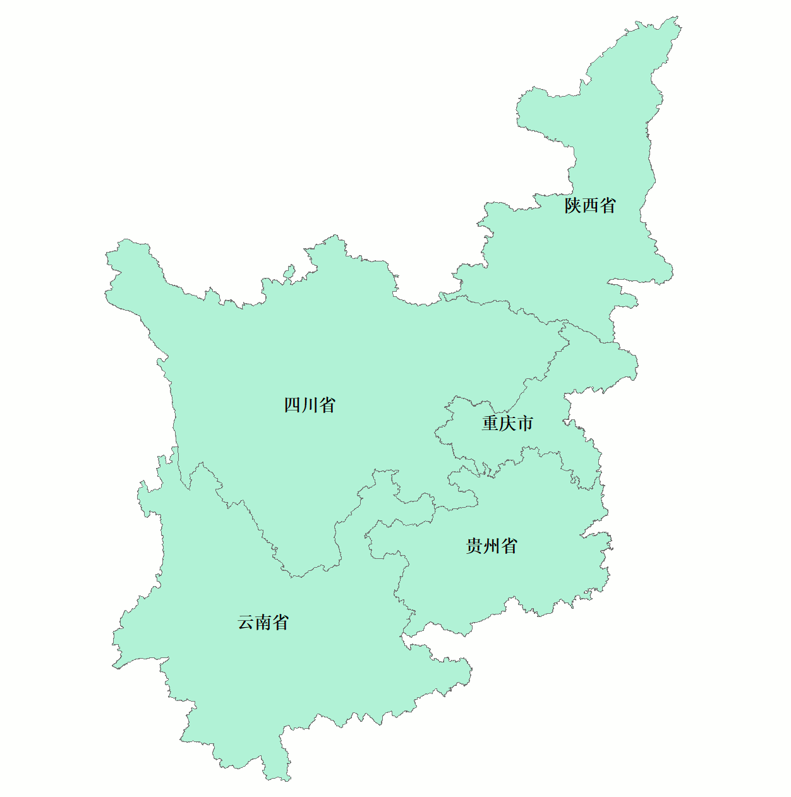

# 2023-12-17更新处理过程记录
处理过程包含两部分代码:

- check_datasets.py
- aver_cal.py

## 01 检查数据集完整性

`check_datasets.py`用于检查数据集的完整性, 包括`MCD12Q1`为土地利用数据、 `MOD11A2`为地表温度数据、 `MOD13A2`为植被指数数据。

1. MCD12Q1数据集(土地利用|每年)检查至2001年~2021年: 
    
        正常

2. MOD11A2数据集(地表温度|8天周期)检查至2000年第48日~2022年第296日：

       MOD11A2*A2001169*h26v05*.hdf: 文件数目(为: 0)不正常
       MOD11A2*A2001169*h26v06*.hdf: 文件数目(为: 0)不正常
       MOD11A2*A2001169*h27v05*.hdf: 文件数目(为: 0)不正常
       MOD11A2*A2001169*h27v06*.hdf: 文件数目(为: 0)不正常
       MOD11A2*A2001177*h26v05*.hdf: 文件数目(为: 0)不正常
       MOD11A2*A2001177*h26v06*.hdf: 文件数目(为: 0)不正常
       MOD11A2*A2001177*h27v05*.hdf: 文件数目(为: 0)不正常
       MOD11A2*A2001177*h27v06*.hdf: 文件数目(为: 0)不正常
       MOD11A2*A2010121*h26v05*.hdf: 文件数目(为: 0)不正常（已下载）
       MOD11A2*A2010121*h26v06*.hdf: 文件数目(为: 0)不正常（已下载）
       MOD11A2*A2010121*h27v05*.hdf: 文件数目(为: 0)不正常（已下载）
       MOD11A2*A2010121*h27v06*.hdf: 文件数目(为: 0)不正常（已下载）
       MOD11A2*A2022289*h26v05*.hdf: 文件数目(为: 0)不正常
       MOD11A2*A2022289*h26v06*.hdf: 文件数目(为: 0)不正常
       MOD11A2*A2022289*h27v05*.hdf: 文件数目(为: 0)不正常
       MOD11A2*A2022289*h27v06*.hdf: 文件数目(为: 0)不正常
其余未标注`已下载`的数据集未官网缺失，目前未解决。

3. MOD13A2数据集(NDVI|16天周期)检查至2000年第48天~2020年第352天：

        正常

## 02 对三大数据集进行全流程预处理

`aver_cal.py`主要对三个数据集(土地利用数据集、NDVI数据集、地表温度数据集)进行镶嵌、重投影并最终输出为GeoTIFF文件。

1. MCD12Q1(土地利用)数据集具体包括读取LC_Type1数据集(IGBP分类标准)、无效值去除(无效值设定为255)、镶嵌(Last模式, 年尺度)、
   重投影、(sinu ==> WGS84, 重采样为最近邻<因为土地利用数据类型为整型>), 输出分辨率为0.045°(500m), 无效值为255.
2. MOD11A2(地表温度)数据集具体包括读取LST_Day_1km、无效值去除(无效值设定为-65535)、单位换算(最终单位为摄氏度)、
   镶嵌(MAX模式, 月尺度)、重投影(sinu ==> WGS84, 重采样为三次卷积), 输出分辨率为0.009°(1000m), 无效值为-65535.
3. MOD13A2(NDVI)数据集具体包括读取1 km 16 days NDVI、无效值去除(无效值设定为-65535)、单位换算、镶嵌(MAX模式, 月尺度)、
   重投影(sinu ==> WGS84, 重采样为三次卷积), 输出分辨率为0.009°(1000m), 无效值为-65535.
4. MOD13A2(EVI)数据集具体包括读取1 km 16 days EVI、无效值去除(无效值设定为-65535)、单位换算、镶嵌(MAX模式, 月尺度)、
   重投影(sinu ==> WGS84, 重采样为三次卷积), 输出分辨率为0.009°(1000m), 无效值为-65535.

# 2024年1月18日更新处理过程记录
处理主要包括:

- 文件名更改(将aver_cal.py更改为process_modis.py)
- 编写process_gldas.py代码

## process_gldas.py
   主要包括对gldas数据集(nc文件)中的`Rain_f_tavg`(降水通量), `Evap_tavg`(蒸散发通量), `Qs_acc`(表面径流量), `Qsb_acc`(地下径流量)
   进行月累加值的计算分别的都月降水量、月蒸散发量、月表面径流量、月地下径流量，依据`TWSC` = 降水量 - 蒸散发量 - (表面径流量 + 地下径流量)。
   需要注意，此时栅格矩阵的范围为-180~180, -60~90.另外进行了无效值的去除(设置为nan)、南北极颠倒、重采样以及重采样后范围偏移的限定。
   最后输出为tiff文件,WGS84坐标系.
   
# 2024年1月19日更新处理过程记录

处理包括:
- uniform_datasets.py
- 修复process_gldas.py Bug

## uniform_datasets.py
   主要是进行各个数据集的统一,统一包括空间范围的限定,研究区域范围如下：
      
   具体是进行掩膜和裁剪至掩膜形状、以及重采样0.1°
   处理的数据集包括:
   - Landuse
   - LST
   - NDVI
   - 降水(PRCP)
   - 蒸散发量(ET)
   - 地表径流量(Qs)
   - 地下径流量(Qsb)
   - TWSC

## 修复process_gldas.py Bug

主要是在gldas数据集的处理中，将所有缺失值均赋值为np.nan，虽然可以正确写入无效值。但是在uniform_datasets.py
的处理中存在无法正确识别无效值np.nan的情况，因此出现了非研究区域的像元值为0.0而非无效值nan。
因此在gldas数据集的处理中将所有无效值设置为-65535，这一操作则与前期处理NDVI、LST、Landuse的操作一致，并没有
直接赋值np.nan，这也就是为什么在uniform_datasets.py中这个三个数据集没有发生意外情况的原因。
   
# 2024年1月22日更新处理过程记录

处理包括:
- feature_engineering.py
- model_train.py
- utils.models.py
- 安装环境requirements.txt

---
## feature_engineering.py
   主要是进行各个特征项和目标项数据集的模型预输入的处理，方便后续的模型的数据加载和训练,
   涉及的数据集包括：
      Landuse: 2001 - 2020
      LST: 200002 - 202210
      NDVI: 200002 - 202010
      ET: 200204 - 202309
      PRCP: 200204 - 202309
      Qs: 200204 - 202309
      Qsb: 200204 - 202309
      TWSC: 200204 - 202309
      dem: single
   由于数据集的某些特殊例如landuse的时间分辨率(年)与其它数据集(月)不同，dem所有训练样本都固定不随时间变化，仅体现地理
   位置上的差异，因此对于landuse和dem进行单独的存储(后续将根据需求进行改写或许, 可能不太方便数据加载或者说数据加载出来
   到可用于模型训练还需要进行一定的数据变换，这需要一定的时间和成本)
   
   处理仅仅将各个数据集整理如下HDF5文件格式：
   - group(2002)
     - features1
     
       _存储月分辨率的数据集(shape为(行数 * 列数<即样本数>, 时间步, 特征数)), 特征项具体为: LST、PRCP、ET、Qs、Qsb、TWSC_
     - features2
     
       _存储年分辨率的数据集(shape为(行数 * 列数)), 特征项具体为: Landuse_
     - targets 
     
       _存储月分辨率的数据集(shape为(行数 * 列数, 时间步)), 目标项具体为: NDVI_
   - group(2003)
     - features1
     - features2
     - targets
   
   - ······
   - dem
     
     _存储DEM的数据集, shape为(行数 * 列数)_

---
## model_train.py

主要是模型的构建的训练以及评估(处于优化中, 依据后续任务进行框架的完善)
模型这里CNN-LSTM模型, cnn为一维卷积且在时间维度上卷积, lstm为常规模型.
目前完成某年部分样本的训练、评估。
这里暂未完全定型，只算草稿版本，后续将完善。

---
## utils.models.py

这里存储定义的模型，目前定义的编码解码lstm模型实际效果不如前面的cnn-lstm模型，暂时搁置。

---
## requirements.txt

考虑的后续项目的维护和迁移，这里增加环境配置的相关信息,配置代码:

```shell
pip install -r I:\PyProJect\Veg\VEG\requirements.txt
```

# 2024年02月29日处理记录

## 增加NDVI、LST的MEAN、MIN处理

修改process_modis.py相关参数，进行NDVI、LST的MEAN、MIN计算

## uniform_datasets.py, feature_engineering.py调整

